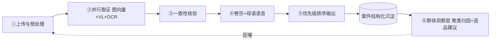
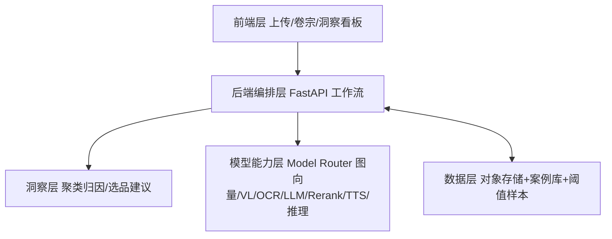

# ReturnGuard（退件法医）· 跨境退货举证官

> 参赛赛道：**AI 市场洞察 · AI 智能选品引擎**（退货纠纷数据驱动的选品避坑与品控洞察）
> 赛事：AI+跨境黑客松巅峰赛 · 创意初赛
> 核心 AI 能力全部经 **阿里云百炼 Model Router** 调用

## 项目简介
ReturnGuard 用多模态 AI 对跨境退货纠纷做**客观取证**（同款一致性比对、瑕疵识别、listing 承诺核验、一键证据卷宗 + 母语语音），并把沉淀的退货数据聚合成**「选品 / 品控洞察」**，反哺选品决策。把售后成本中心变成市场洞察数据源——用已成交的真实退货负面信号驱动选品，比公开评论更可信。

## 核心能力 → 模型映射（阿里云百炼 Model Router）
| 能力 | 模型 |
|---|---|
| 多模态图像向量（同款一致性） | `qwen/tongyi-embedding-vision-plus` |
| 视觉理解（瑕疵识别 / 一致性） | `qwen/qwen3-vl-plus` |
| OCR（提取 listing 承诺） | `qwen/qwen-vl-ocr` |
| 文本生成 / 多语（卷宗 / 陈述） | `qwen/qwen3-max` |
| 排序（案件优先级） | `qwen/qwen3-rerank` |
| 语音合成（母语陈述） | `qwen/qwen3-tts-instruct-flash` |
| 推理 / 聚类（洞察层） | `qwen/deepseek-r1` |

## 取证工作流（双闭环）


## 系统架构


## 复赛冲刺能力（v1.1.0）
- **A 组 · 假能力变真**：live 模式真实接入图向量同款比对 / VL 瑕疵识别（真实红框）/ OCR / rerank，统一**图床抽象**（OSS / `PUBLIC_IMAGE_BASE` / 本地回退）供模型服务端回源；未开通的模型**逐能力自动回退** mock 并标记，gateway 渐进开通即生效。
- **B 组 · 数据闭环**：时间序列 + 次月预测预警；CSV 批量导入真实退货数据（`POST /api/import_csv`）+ 平台连接器位；相似度阈值**自标定**（Youden J 最优切点）；选品避坑**可执行清单**。
- **C 组 · 多租户 + 合规 + 国产化**：注册/登录/令牌（一个用户=一个租户），real 源案件按租户隔离（私有严格隔离 + `public` 公共基准）；XSS 全量转义 + CSP 防御纵深；负向/一致性测试补齐；region/season 维度下钻；**openGauss 部署 + 启动自动导入**（`RG_AUTO_IMPORT_CSV`，幂等）。

## 快速开始
```bash
cd returnguard/demo
pip install -r requirements.txt
uvicorn main:app --host 0.0.0.0 --port 8000
# 浏览器打开 http://localhost:8000
```
- 开发期默认 SQLite（demo 种子 + real 空库），零配置起跑。
- 部署 openGauss：设 `REAL_DATABASE_URL` 指向 openGauss + `RG_AUTO_IMPORT_CSV=<csv>` 启动自动导入，详见 [`openGauss部署指南.md`](openGauss部署指南.md)。
- 可选环境变量：`ANALYZE_API_KEY`（写接口鉴权）、`AUTH_SECRET`（令牌签名，生产必设）、`FORCE_RESEED=1`（重置 demo 种子）。

## 验证脚本
`verify_api.py`：纯标准库、零依赖，验证两项关键能力是否真能跑通：
- **图向量比对**（核心）：`tongyi-embedding-vision-plus` 嵌入两张图 → 余弦相似度。
- **TTS → ASR 闭环**：用 API 自身 TTS 合成语音 → `qwen3-asr-flash` 转写回来，验证语音端点。

运行：
```bash
export MODEL_ROUTER_API_KEY=sk-xxx   # Windows: set MODEL_ROUTER_API_KEY=sk-xxx
python verify_api.py
```

## 提交状态
- **初赛**：创意方案已通过官方在线表单提交（完整版见 `ReturnGuard_方案.md`，表单精简版见 `ReturnGuard_表单提交文案.md`）。
- **复赛规划**：可运行 Web Demo（上传退件图 → 相似度 / 瑕疵 / 卷宗 / 语音 + 洞察看板）+ GitCode 仓库 + 3 分钟演示视频 + 容器化体验地址（详见方案 4.5 节）。

## 目录
- `verify_api.py` — 关键 API 验证脚本
- `README.md` — 本文件
- `CHANGELOG.md` — 版本变更记录（v1.0.0 → v1.1.0）
- `openGauss部署指南.md` — openGauss 真实部署 + 真实数据自动导入
- `demo/` — FastAPI 应用：`main.py`（入口）、`pipeline.py`（取证/洞察）、`models_router.py`（真实模型 + 逐能力回退）、`auth.py`（账户/多租户）、`calibration.py`（阈值自标定）、`importer.py`（CSV 回流）、`storage.py`（图床）、`seed_real.csv`（自动导入样例）
- （完整方案 / 表单文案在项目根目录 `ReturnGuard_方案.md`、`ReturnGuard_表单提交文案.md`）
