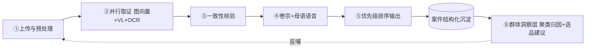
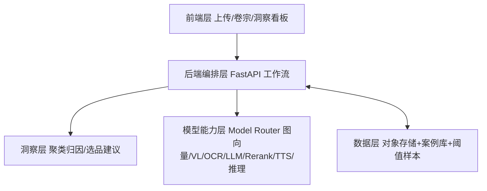

# ReturnGuard · 跨境退货情报站

> 参赛赛道：**AI 市场洞察 · AI 智能选品引擎**（退货纠纷数据驱动的选品避坑与品控洞察）
> 赛事：AI+跨境黑客松巅峰赛 · 复赛　|　团队：**Lumio**
> 核心 AI 能力全部经 **阿里云百炼 Model Router** 调用
> 初赛过程材料见 `docs/legacy/`

> **命名约定**：全仓统一使用「**ReturnGuard 退货情报站**」。旧称「退件法医 / 跨境退货举证官」为单案取证时代的旧名（偏"鉴定/追责"），仅存于 `docs/legacy/` 历史材料中，新文档一律不再使用。

## 电梯陈述（一句话）

> 跨境卖家 20%–30% 的退货率里，真正该赔的只是一部分，更多是因为「拿不出客观证据」而白白败诉。
> ReturnGuard 用图像向量、视觉理解与语音合成，把每一笔退货变成可量化的取证报告；再把所有案件聚合成选品与品控洞察——**既在单笔纠纷里少赔，又从源头看懂钱漏在哪**。

## 一分钟速览（评委 / 体验入口）

- **公网体验地址**：https://rg.a703201sworld.top （Cloudflare Tunnel 固定域名）
- **测试账号**：`demo` / `demo123`
- **代码仓库**：GitHub `a703201/ReturnGuard`（主仓库，`https://github.com/a703201/ReturnGuard`）；Gitea 镜像 `git@100.103.184.33:a703201/ReturnGuard.git`；GitCode 镜像 `https://gitcode.com/a703201/ReturnGuard`（已公开，三路同步推送）
- **当前版本**：1.1.2（仓库根 `VERSION` 为单一来源，与 `/api/config` 一致）
- **演示数据集**：1206 条退货案件 · 9 个平台 · 胜诉率 34.6%
  - **来源口径（重要）**：由 **Amazon Returns / UCI Online Retail / TheLook** 三个**公开数据集融合加工**而成，非平台私有数据；其中**平台字段为按「品类 × 地区」规则重映射的演示渠道标签**（用于覆盖 9 个平台的举证规则演示），并非原始数据集自带的平台字段。完整构建规则见 `demo/convert_datasets.py` 的 `DATASET_PLATFORM_RULES` 与模块 docstring。
- **图床**：**本地自持**（`local` 签名短链 / `self` 自托管隧道 / `public_base` 自建反代，默认 `local`，配了隧道/反代则自动升级为 `self`/`public_base`），退货图不出境；**远端对象存储（七牛云）接口已预留**（`IMAGE_BED=qiniu` 显式开启，默认关闭），复赛演示不启用第三方云
- **Live 合规**：支持 `official`（**赛事指定 Model Router，提交口径**）/ `tokenplan`（Token Plan 自测网关）/ `dashscope`（自购通道）三 profile，改 `MODEL_ROUTER_PROFILE` 一键切换，`base_url` + key + 模型标识三者联动；逐项核对见 `复赛交付物/LIVE_COMPLIANCE.md`。
- **定位**：退货纠纷「只取证不裁决」——客观取证 + 群体退货数据 → 选品避坑 / 品控洞察

## 系统架构一览


- **前端层**：单页应用（上传/卷宗/洞察看板/数据录入），demo-real 双源切换
- **后端编排层**：FastAPI DAG（并行取证 + 洞察聚合 + 多租户）
- **模型能力层**：阿里云百炼 Model Router（7 能力，live/mock 韧性切换）
- **洞察层（产品核心）**：聚类归因 / 预测预警 / 选品避坑 / 供应商品控
- **数据层**：demo 库（演示种子，openGauss `returnguard`）+ real 库（真实数据，独立库 `returnguard_real`），**双库物理隔离**（real 写入绝不污染 demo 看板，P0 已验证）

## 项目里程碑时间线（P0-3）

| 阶段 | 时间 | 关键产出 |
|---|---|---|
| 立项 & 数据集 | 2026-07 | 确定「退货法医 + 退货反推选品避坑」空白定位；固定种子生成多维合成退货案件基线 |
| 单案取证 live 化 | 2026-08-19 | 阿里云百炼 Token Plan 网关真接入图向量同款比对 / VL 瑕疵识别（真实红框）/ OCR / rerank，逐能力回退 mock |
| 群体洞察看板 | 2026-08 | 聚类归因 / 预测预警 / 选品避坑清单 / 供应商品控，洞察层成型（产品核心） |
| 进入复赛 | 2026-08-25 | 确认 AI+跨境黑客松巅峰赛复赛资格（场景三 · AI 市场洞察） |
| 数据集融合重建 | 2026-08-27 | 演示库替换为 **1206 条**退货案件（融合 Amazon Returns / UCI Online Retail / TheLook 三个公开数据集，平台字段按品类×地区重映射），平台由 4 个扩展至 **9 个**（胜诉率 **34.6%**） |
| 公网可体验 | 2026-08-27 | Cloudflare Tunnel 固定域名 https://rg.a703201sworld.top（测试账号 demo/demo123） |
| 部署加固 | 2026-08-29 | 切换 openGauss 部署（demo/real/auth 三库全 openGauss）；修复 sku_name 长度溢出 / Docker 本地 WAL disk I/O error / 前端 ESM 拆分点击无反应 / 版本号 Vunknown；测试 86 → **88 passed** |
| 复赛交付 | 2026-09-01 ~ 09-13 | 可运行 Demo + 演示视频 + 技术说明 + GitCode 镜像仓库 + 测试账号 + 阶段成果 |
| 决赛路演 | 2026-09-25 | 数贸会现场路演（完成度 / 业务价值 / 技术创新 / 用户体验 / 商业落地） |

> 时间线同步置顶架构图，便于评委一眼看清「从创意到复赛」的推进节奏。

## 项目简介
ReturnGuard 用多模态 AI 对跨境退货纠纷做**客观取证**（同款一致性比对、瑕疵识别、listing 承诺核验、一键证据卷宗 + 母语语音），并把沉淀的退货数据聚合成**「选品 / 品控洞察」**，反哺选品决策。把售后成本中心变成市场洞察数据源——用已成交的真实退货负面信号驱动选品，比公开评论更可信。

## 核心能力 → 模型映射（阿里云百炼 Model Router）

> ⚠️ **两个网关的模型命名不同**：赛事指定 Model Router（`model-router.edu-aliyun.com`）要求**全部模型带 `qwen/` 前缀**；Token Plan 网关的文本/TTS 用无前缀旧名。切换 profile 时 base_url + key + 模型标识三者一并切换，否则 404。代码单一来源：`demo/models_router.py` 的 `_MODEL_ROUTER_PROFILES`。

| 能力 | `official`（赛事指定 · 提交口径） | `tokenplan`（Token Plan 自测） |
|---|---|---|
| 同款一致性（VL 直接判同款） | `qwen/qwen3-vl-plus` | 同左 |
| 视觉理解（瑕疵识别 / 红框定位） | `qwen/qwen3-vl-plus` | 同左 |
| OCR（提取 listing 承诺） | `qwen/qwen-vl-ocr` | 同左 |
| 文本生成 / 多语（卷宗 / 陈述 / 洞察归因） | `qwen/qwen3.7-max` | `qwen3.7-max` |
| 排序（案件优先级） | `qwen/qwen3-rerank` | `qwen3-rerank` |
| 语音合成（母语陈述） | `qwen/qwen3-tts-instruct-flash` | `qwen-audio-3.0-tts-plus` |

> 说明：洞察层（聚类归因 / 选品建议）复用文本模型，**不单独调用 deepseek 系列**；`demo/compare_models.py` 中的 `deepseek-v4-pro` / `kimi-k2.6` 等仅供模型对比实验，非线上链路。
>
> 同款一致性说明：百炼 OpenAI 兼容模式**不支持视觉向量模型**（`tongyi-embedding-vision-plus` 会返回 `Unsupported model ... for OpenAI compatibility mode`），故线上主路径为 **VL 模型同时看退回件与本店主图直接判同款**（`models_router.vl_similarity`）——更贴合"调包 / 同款"的业务判定；图像向量仅在通道开通后作备选，再不可用时回退到与 mock **同口径**的内容哈希（见 `demo/imghash.py`）。

## 取证工作流（双闭环）


## 系统架构


## 复赛冲刺能力（1.1.2）

> 安全复审全量闭环：公网部署语境下安全发现项 **SEC-1 ~ SEC-12 全部清零**——写接口鉴权、签名短链收敛 PII、CSP nonce 硬化、多 worker 共享状态外置、KDF 提至 60 万轮、API Key 常量时间比较。当前测试 **107 passed 全绿**（含 `/api/export_pdf` 与 `/api/import_csv` 链路补齐、`test_storage.py` 重写对齐当前存储层），安全面达 A 区间。
- **A 组 · 假能力变真**：live 模式真实接入图向量同款比对 / VL 瑕疵识别（真实红框）/ OCR / rerank，统一**可插拔图床抽象**（`local` 签名短链 / `self` 自托管隧道 / `public_base` 自建反代 / `qiniu` 远端预留）供模型服务端回源——**默认本地自持、退货图不出境**；未开通的模型**逐能力自动回退** mock 并标记，gateway 渐进开通即生效。
- **B 组 · 数据闭环**：时间序列 + 次月预测预警；CSV 批量导入真实退货数据（`POST /api/import_csv`）+ 平台连接器位；相似度阈值**自标定**（Youden J 最优切点）；选品避坑**可执行清单**。
- **C 组 · 多租户 + 合规 + 国产化**：注册/登录/令牌（一个用户=一个租户），real 源案件按租户隔离（私有严格隔离 + `public` 公共基准）；XSS 全量转义 + CSP 防御纵深；负向/一致性测试补齐；region/season 维度下钻；**openGauss 部署 + 启动自动导入**（`RG_AUTO_IMPORT_CSV`，幂等）。

## 工程收口（赛后小项）

在答辩所需关键项全部收口后，针对大厂审查报告的赛后级条目做了几处低风险的工程加固（均不改变外部行为）：

- **P1-12 洞察聚合投影**：`load_filtered_cases` 在行→dict 后剔除 `voice_audio_b64` / `dossier` 两个 base64/Text 大字段，避免 1206 行 × 大对象的无谓 IO 与内存放大（单案取证路径不受影响）。
- **P2-4 重复代码去重**：`_gen_wav` 下沉为 `demo/audio_utils.py` 单一来源（原 pipeline / models_router 各一份逐字副本）；`_norm_date_key` 统一引用 `db._norm_date_key`（importer 不再自带副本）。
- **P2-2 接口契约统一**：除 `/api/analyze`、`/api/insights` 外，/health、/api/config、/metrics、/api/platforms、/api/cases、/api/auth/*、/api/calibrate、/api/import_* 等接口补上 `response_model`（新增 `HealthResp` / `PlatformsResp` / `AuthTokenResp` / `SimpleOkResp` / `DeleteCaseResp`）。
- **P2-11 去硬编码路径**：`start_rg.py`、`public-demo.bat` 的 cloudflared / 隧道配置路径改为环境变量可覆盖；`deploy/rg-tunnel.yml` 移除写死的本机用户名凭证路径（cloudflared 默认从 `%USERPROFILE%/.cloudflared/<tunnel-id>.json` 读取）。
- **P1-2（降 P2）注释对齐**：`shared_state.py` 注释与部署决策对齐——共享状态库仅支持 SQLite（upsert 依赖 `ON CONFLICT`），明确不可指向 openGauss，消除原注释「可指向 openGauss」的误导。
- **P2-8 匿名登录体验**：写接口（取证 / 导入 / 删除）收到 401 时主动弹出登录框衔接，而非只抛一行错误（前端已在多处落地）。
- **P2-5 connector 批量去 N+1**：`import_from_connector` 改用 `bulk_upsert_cases` 单事务批量写入，消除此前逐行 `save_case` 的 N+1 旧链路；`save_case` 已不再被本模块引用。
- **P2-9 提示词版本管理 / A-B**：`prompts.py` 新增 `PROMPT_VERSION` 常量与 `_PROMPT_VARIANTS` 注册表（含 `current_prompt_variant()`），insights system persona 注入 `[提示词版本：X / variant=Y]` 标识，便于回滚与 A/B 对照。
- **P2-12 CI 安全门禁**：`.github/workflows/ci.yml` 将 mypy 由「continue-on-error 不阻断」升级为**阻断门禁**；新增 `bandit` 源码安全审计与 `pip-audit` 依赖 CVE 扫描（先以可见性优先运行，基线稳定后可去 `continue-on-error` 转阻断）。
- **P2-14 幻觉数值校验**：`pipeline._reconcile_insights` 新增 LLM 输出与真实聚合数值一致性校验——win_rate / total_cases / 各维胜诉率与聚合偏差超阈值即回退 mock 聚合并标注 `reconciled_from='aggregate'`，不再仅靠 prompt 约束防幻觉。
- **P2-6 前端骨架屏 + 构建链路**：`index.html` 加 shimmer 骨架屏样式，首屏数据抵达前显示占位（渲染覆盖后自然消失）；新增 `package.json` + `scripts/minify.mjs` 轻量 terser 压缩构建链路（作为建议项**不接入 CI**，以免破坏演示现场）。
- **P2-7 前端 i18n**：新增 `demo/static/i18n.js`（zh/en 字典 + `t()` / `setLang()` / `applyI18n()`），顶栏新增语言切换并持久化偏好；可见标签抽取 `data-i18n` 接线（默认 zh 与现界面一致，en 为对照译本），为跨境场景打底。
- **P2-1 平台分布口径说明**：数据集本身不均衡（Amazon 444/37% vs Lazada 38/3%），"9 平台均衡"为按「品类 × 地区」重映射的演示展示口径，已在评委指引与平台举证包文案中如实标注，代码中不伪造均衡分布。

### 第二轮收口（2026-09-10 多维度复查项）

- **N1/N2 图床后端化（本地默认 + 远端预留）**：`storage.py` 重构为**可插拔后端注册表**——`local`（签名短链）/ `self`（自托管隧道）/ `public_base`（自建反代）自动优先级，`qiniu` 远端对象存储为**预留接口**（`IMAGE_BED=qiniu` 显式开启，SDK 缺失自动降级，**复赛不启用**）；同步修正 README/CHANGELOG/CODE_REVIEW 中"七牛云已激活"的**口径漂移**；启动日志与 `/api/config` 透出实际后端。
- **N5 单案优先级接入 rerank**：`live_analyze` 用 `qwen3-rerank` 对单案紧急性打分（语义化 query = `_PRIORITY_QUERY`），与本地可解释公式 **5:5 融合**；`capabilities["rerank"]` 如实标注真实/回退，网关未开通即回退确定性公式。
- **N8 供应商维度扩充（3 家 → 8 家）**：新增 `suppliers.py` 单一来源（缺陷定池 + SKU 熵），修正原哈希退化成"仅 S2/S3/S6"的问题——演示数据集供应商由 **3 家扩展到 8 家**（S1~S8），红黑榜与「平台 × 供应商」交叉信息量显著提升。
- **N6 ROI 面板接入真实数据**：客单价（退款 ÷ 案件数）与争议占比（代理嫌疑率）按当前看板**真实值**自动填入并标注「真实 / 假设」，附数据来源行，不再纯静态示例。
- **N3 i18n 扩容**：`data-i18n` 由 14 处扩展到 **30 处**（新增 15 张卡片标题 + 关键按钮），`i18n.js` 字典补齐 zh/en。
- **N4 构建链路可用化**：`scripts/minify.mjs` 输出到 `dist/` 并**重写 ESM 相对导入**（`./x.js` → `./x.min.js`），生成 `dist/index.html`；设 `SERVE_MINIFIED=1` 即启用压缩产物（实测 **-31%**），默认仍发未压缩源，演示现场零风险。

> 当前测试 **111 passed 全绿**（`ruff format` / `ruff check` / `mypy` / `pytest --cov-fail-under=75` 四道门禁本地全通过，覆盖率 76.7%）。

## 快速开始
```bash
cd returnguard/demo
pip install -r requirements.txt
uvicorn main:app --host 0.0.0.0 --port 8000
# 浏览器打开 http://localhost:8000
```
- **开发与部署统一使用 openGauss**（华为开源国产库，兼容 PostgreSQL 协议）：本地先 `docker compose -f docker/docker-compose.yml up -d db` 获得 `localhost:5432/returnguard`，`db.py` 默认即连 openGauss；demo 与 auth 落在 `returnguard`，real 落在**独立库 `returnguard_real`**（见 [`openGauss部署指南.md`](openGauss部署指南.md)）；仅在无 openGauss 的离线 / CI 环境才显式回退 SQLite（`DATABASE_URL=sqlite:///...`）。
- 部署 openGauss：`docker compose -f docker/docker-compose.yml up -d`（含 openGauss 服务 + `realdb-init` 自动建独立 real 库）；或设 `DATABASE_URL`/`AUTH_DATABASE_URL`/`REAL_DATABASE_URL` 指向 openGauss + `RG_AUTO_IMPORT_CSV=<csv>` 启动自动导入，详见 [`openGauss部署指南.md`](openGauss部署指南.md)。
- 可选环境变量：`AUTH_SECRET`（令牌签名，生产必设）、`FORCE_RESEED=1`（重置 demo 种子，compose 已透传）。写接口鉴权统一走**登录会话**（内置 demo/demo123 账户），不再有免登录 API Key 通道（`ANALYZE_API_KEY` 已废弃移除）。`STATE_DB_URL` 默认留空、回退内置 SQLite（`rg_state.db`）承载跨 worker 限流/登录锁 KV——openGauss 不支持 `ON CONFLICT` upsert，故刻意不指向 openGauss。
- 安全相关环境变量（公网部署必设）：
  - `AUTH_SECRET`：令牌 HMAC 签名密钥（`secrets.token_hex(32)` 生成，生产必设，否则每次重启令牌失效）。
  - `AUTH_TRUSTED_PROXIES`：可信任的反代网段（Cloudflare Tunnel 部署设 `127.0.0.1`，使限流/防爆破按真实客户端 IP 生效）。
  - `ADMIN_API_KEY`：`/api/calibrate`、`/metrics` 管理端点密钥（不设置则仅登录会话可访问）。
  - `REGISTRATION_ENABLED`：公网演示设 `false`（用内置 demo/demo123）；可选 `REGISTRATION_INVITE_CODE` 邀请制。
  - `LOGIN_MAX_FAILS` / `LOGIN_LOCK_MIN`：登录防爆破阈值与锁定时长（分钟）。
  - `UPLOAD_URL_TTL`：上传图签名短链有效期（秒，默认 3600）。
- 上传图不再经 `/uploads` 公开挂载，改为 HMAC 签名短链 `/api/file/{sig}`（PII 收敛，详见 `docs/API.md` §3.6 与 `CHANGELOG.md` SEC-8）。

## 验证脚本
`verify_api.py`：纯标准库、零依赖，验证两项关键能力是否真能跑通：
- **图向量比对**（核心）：`qwen/tongyi-embedding-vision-plus`（tokenplan 下为无前缀 `tongyi-embedding-vision-plus`）嵌入两张图 → 余弦相似度。
- **TTS → ASR 闭环**：用 API 自身 TTS 合成语音 → `qwen3-asr-flash` 转写回来，验证语音端点。

运行：
```bash
export MODEL_ROUTER_API_KEY=sk-xxx   # Windows: set MODEL_ROUTER_API_KEY=sk-xxx
python verify_api.py
```

## 提交状态
- **初赛**：创意方案已通过官方在线表单提交（完整版见 `docs/legacy/ReturnGuard_方案.md`，表单精简版见 `docs/legacy/ReturnGuard_表单提交文案.md`）。
- **复赛规划**：可运行 Web Demo（上传退件图 → 相似度 / 瑕疵 / 卷宗 / 语音 + 洞察看板）+ GitCode 仓库 + 3 分钟演示视频 + 容器化体验地址（详见方案 4.5 节）。

## 目录
- `verify_api.py` — 关键 API 验证脚本
- `README.md` — 本文件
- `CHANGELOG.md` — 版本变更记录（当前 1.1.2）
- `openGauss部署指南.md` — openGauss 真实部署 + 真实数据自动导入
- `demo/` — FastAPI 应用：`main.py`（装配层：app 创建 / 中间件注册 / 路由聚合 / lifespan）、`common.py`（配置 / 依赖 / 限流 / 中间件 / 聚合辅助）、`routers/`（按域拆分：`frontend` / `forensic` / `insights` / `auth` / `calibration` / `import_`）、`pipeline.py`（取证/洞察）、`models_router.py`（真实模型 + 逐能力回退）、`auth.py`（账户/多租户）、`calibration.py`（阈值自标定）、`importer.py`（CSV 回流）、`storage.py`（图床）、`seed_real.csv`（自动导入样例）
- （初赛完整方案 / 表单文案已归档至 `docs/legacy/`）
