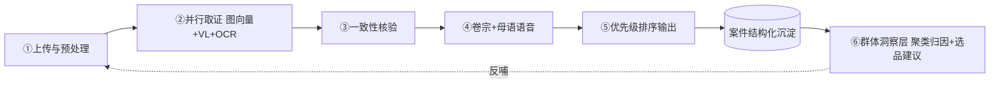
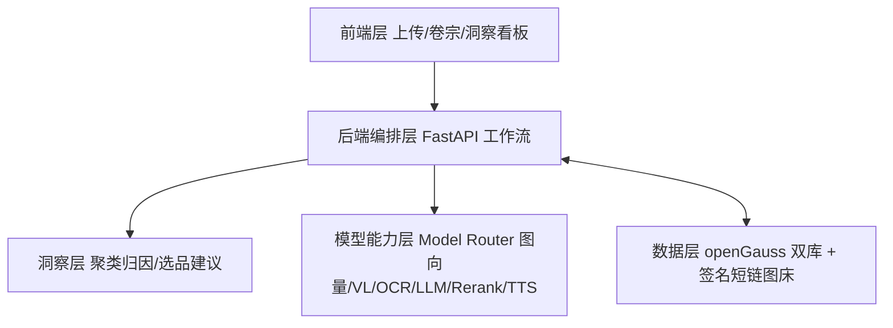

# ReturnGuard · 跨境退货情报站

> **业务方向**：AI 市场洞察 · 智能选品引擎（退货纠纷数据驱动的选品避坑与品控洞察）
> **核心 AI 能力**：经 **阿里云百炼 Model Router** 调用（文本 / 视觉 / OCR / 重排 / 语音）

> **命名约定**：全仓统一使用「**ReturnGuard 退货情报站**」。历史曾用名「退件法医 / 跨境退货举证官」偏「鉴定 / 追责」语义，已全部废弃，新代码与新文档一律不再使用。

## 电梯陈述（一句话）

> 跨境卖家 20%–30% 的退货率里，真正该赔的只是一部分，更多是因为「拿不出客观证据」而白白败诉。
> ReturnGuard 用图像向量、视觉理解与语音合成，把每一笔退货变成可量化的取证报告；再把所有案件聚合成选品与品控洞察——**既在单笔纠纷里少赔，又从源头看懂钱漏在哪**。

## 一分钟速览

- **当前版本**：2.1.0（仓库根 `VERSION` 为单一来源，与 `/api/config`、`package.json` 一致）
- **本机访问**：`http://127.0.0.1:65432`（容器）/ `http://127.0.0.1:8000`（直接 `uvicorn`）
- **内置演示账号**：`demo` / `demo123`
- **代码仓库**：GitHub `a703201/ReturnGuard`（主）；Gitea / GitCode 为镜像
- **演示数据集**：1206 条退货案件 · 9 个平台 · 胜诉率 34.6%
  - **来源口径（重要）**：由 **Amazon Returns / UCI Online Retail / TheLook** 三个**公开数据集融合加工**而成，非平台私有数据；其中**平台字段为按「品类 × 地区」规则重映射的演示渠道标签**（用于覆盖 9 个平台的举证规则演示），并非原始数据集自带的平台字段。完整构建规则见 `demo/convert_datasets.py` 的 `DATASET_PLATFORM_RULES` 与模块 docstring。
- **图床**：**本地自持**（`local` 签名短链 / `self` 自托管反代 / `public_base` 自建反代，默认 `local`），退货图不出境；**远端对象存储（七牛云）接口已预留**（`IMAGE_BED=qiniu` 显式开启，默认关闭）
- **AI 平台（多厂商可选）**：`tokenplan`（默认）/ `official` / `dashscope` / `openai` / `deepseek` / `moonshot` / `zhipu` / `siliconflow` / `openrouter` / `ollama`（本机）/ `azure_openai` / `custom`（任意 OpenAI 兼容自建端点）；
  改 `MODEL_ROUTER_PROFILE` 一键切换，`base_url` + 密钥 + 模型标识随平台声明联动，能力缺口如实标注回退。详见 [`docs/AI_PROVIDERS.md`](docs/AI_PROVIDERS.md)
- **定位**：退货纠纷「只取证不裁决」——客观取证 + 群体退货数据 → 选品避坑 / 品控洞察

## 系统架构一览


- **前端层**：单页应用（上传 / 卷宗 / 洞察看板 / 数据录入），demo-real 双源切换
- **后端编排层**：FastAPI DAG（并行取证 + 洞察聚合 + 多租户）
- **模型能力层**：阿里云百炼 Model Router（7 能力，live/mock 韧性切换）
- **洞察层（产品核心）**：聚类归因 / 预测预警 / 选品避坑 / 供应商品控
- **数据层**：demo 库（演示种子，openGauss `returnguard`）+ real 库（真实数据，独立库 `returnguard_real`），**双库物理隔离**；连接串未显式配置时由 demo 串**自动推导**出独立 real 库，任何部署形态都默认分库

## 项目简介

ReturnGuard 用多模态 AI 对跨境退货纠纷做**客观取证**（同款一致性比对、瑕疵识别、listing 承诺核验、一键证据卷宗 + 母语语音），并把沉淀的退货数据聚合成**「选品 / 品控洞察」**，反哺选品决策。把售后成本中心变成市场洞察数据源——用已成交的真实退货负面信号驱动选品，比公开评论更可信。

## 核心能力 → 模型映射

> **平台无关设计**：业务代码只按「能力」调用（文本 / 视觉 / OCR / 图像向量 / 重排 / 语音），
> 平台、端点、鉴权与模型标识全部声明在 [`demo/providers.py`](demo/providers.py)，
> 调用时由 `demo/models_router.py` 通过能力闸校验。**新增平台不改调用代码。**
> 完整平台矩阵与差异适配见 [`docs/AI_PROVIDERS.md`](docs/AI_PROVIDERS.md)（也可运行时查 `GET /api/providers`）。

> ⚠️ **不同平台的模型命名不同**：官方 Model Router 要求**全部模型带 `qwen/` 前缀**；
> Token Plan 用无前缀旧名；Ollama 用 `模型:标签`；SiliconFlow / OpenRouter 用 `org/model`。
> 切换平台时 base_url + 密钥 + 模型标识随声明一并切换，否则 404。

下表以阿里云百炼系为例（其余平台见 `GET /api/providers`）：

| 能力 | `official` | `tokenplan` |
|---|---|---|
| 同款一致性（VL 直接判同款） | `qwen/qwen3-vl-plus` | 同左 |
| 视觉理解（瑕疵识别 / 红框定位） | `qwen/qwen3-vl-plus` | 同左 |
| OCR（提取 listing 承诺） | `qwen/qwen-vl-ocr` | 同左 |
| 文本生成 / 多语（卷宗 / 陈述 / 洞察归因） | `qwen/qwen3.7-max` | `qwen3.7-max` |
| 排序（案件优先级） | `qwen/qwen3-rerank` | `qwen3-rerank` |
| 语音合成（母语陈述） | `qwen/qwen3-tts-instruct-flash` | `qwen-audio-3.0-tts-plus` |

> 洞察层（聚类归因 / 选品建议）**复用文本模型**，不单独调用 deepseek 系列；`demo/compare_models.py` 中的 `deepseek-v4-pro` / `kimi-k2.6` 等仅供模型对比实验，非线上链路。
>
> 同款一致性说明：百炼 OpenAI 兼容模式**不支持视觉向量模型**（`tongyi-embedding-vision-plus` 会返回 `Unsupported model ... for OpenAI compatibility mode`），故线上主路径为 **VL 模型同时看退回件与本店主图直接判同款**（`models_router.vl_similarity`）——更贴合「调包 / 同款」的业务判定；图像向量仅在通道开通后作备选，再不可用时回退到与 mock **同口径**的内容哈希（见 `demo/imghash.py`）。

## 取证工作流（双闭环）



## 系统架构



## 主要能力

### A 组 · 真实模型接入（非演示壳）

- live 模式真实接入图向量同款比对 / VL 瑕疵识别（**真实红框坐标**）/ OCR / rerank / TTS，统一**可插拔图床抽象**（`local` 签名短链 / `self` 自托管 / `public_base` 自建反代 / `qiniu` 远端预留）供模型服务端回源——**默认本地自持、退货图不出境**；未开通的模型**逐能力自动回退** mock 并如实标记（`capabilities` 字典 / `defect_boxes_live`），网关渐进开通即生效。
- 诚实性红线：`mode`、`defect_boxes_live`、`capabilities` 必须如实反映真实调用情况，**不把演示示意说成真实模型输出**。

### B 组 · 数据闭环

- 时间序列 + 次月预测预警；CSV / xlsx 批量导入真实退货数据（`POST /api/import_csv`、`POST /api/import_file`）+ 平台连接器位。
- 相似度阈值**自标定**（Youden J 最优切点）；选品避坑**可执行清单**。
- **ROI 真实回测**：基于真实聚合值的保守 / 基准 / 乐观三档 + 单因子敏感性，`method` / `disclaimer` 强制随结果下发（明确声明「模型回测，非 A/B 实测因果」）。
- **A/B 台架** `demo/ab_experiment.py`：同批案件、同模型、同聚合输入下只改 prompt 变体，量化 JSON 可用率 / 幻觉对账 / 耗时。

### C 组 · 多租户 + 合规 + 国产化

- 注册 / 登录 / 令牌（一个用户 = 一个租户），real 源案件按租户严格隔离（私有隔离 + `public` 公共基准）；demo 源为共享只读演示库，**禁止删除、禁止写入**（写入一律归正到 real 源，避免污染演示基准）。
- XSS 全量转义 + CSP 防御纵深；openGauss 部署 + 启动自动导入（`RG_AUTO_IMPORT_CSV`，幂等）。

### D 组 · 安全与配额（SEC-1 ~ SEC-13 全清零）

- 写接口须**登录会话**（`Authorization: Bearer` / `X-Token`），管理端点须 `ADMIN_API_KEY` 或登录；`?token=` 查询参数已停用。
- PII 收敛：退货图经 HMAC 签名 + TTL 短链 `/api/file/{sig}` 提供，`/uploads` 公开挂载已移除。
- 令牌 HMAC 无状态签名；口令 pbkdf2 **60 万轮**、未知用户跑等代价哈希消除枚举时序差、登录即渐进 rehash。
- 限流 / 登录封禁 / **live 配额**外置到 `rg_state.db`（多 worker 一致）；数据库仅监听回环。
- **SEC-13 live 配额闸**：三层（全局日 / 账号日 / IP 小时），**覆盖 `/api/analyze`、`/api/insights?mode=live` 与 `/api/export_pdf?mode=live`** 三条会消耗付费 Key 的链路，超限 `429` + 明确文案，**不静默降级为 mock**。

### 界面与本地化

- 界面 **zh / en / fr** 三语，顶栏切换并持久化；静态文案走 `data-i18n`，动态渲染走 `t()`，词典键完整性由 `scripts/check_i18n.py` 强制对齐。
- 母语语音陈述支持 8 个语种（`zh`/`en`/`es`/`pt`/`de`/`fr`/`ja`/`ko`），语言 → 音色映射为单一来源（`demo/constants.py`）。
- 数字与日期按语言格式化（`fr-FR` 为窄不换行空格千分位 + 逗号小数点）。
- **边界声明**：后端返回的**数据值**（洞察正文、缺陷标签、供应商名）保持原始语言；表单 `value` 是入库枚举（`赢`/`部分退款`/`输`/`待分析`），不随翻译改变。

## 2.1.0 · 判定逻辑成文 · 多 AI 平台适配 · 首启引导（本次变更）

**文档：把「怎么判定」和「怎么实现」写清楚**

- 新增 [`docs/DECISION_LOGIC.md`](docs/DECISION_LOGIC.md) —— **退货判定逻辑说明**：
  逐条给出「输入 → 规则/阈值 → 输出 → 边界与回退」，覆盖同款一致性、瑕疵标签、货不对板、
  优先级、缺陷红框、胜诉率口径、代理争议率、供应商质量分与红黑榜、根因归因、SKU 异常预警、
  时序预测、ROI 回测口径、LLM 数字对账、写入收敛与入参边界，并附「想改某条判定该动哪里」索引。
- 新增 [`docs/ARCHITECTURE.md`](docs/ARCHITECTURE.md) —— **功能实现逻辑**：
  分层与依赖方向、两条主链路（单案取证 / 群体洞察）执行顺序、三层缓存与失效条件、
  AI 调用与韧性（重试/退避/熔断/总预算/能力闸）、隔离与安全收口、前端实现要点、
  可观测性与质量门禁。

**多 AI 平台接口适配**

- 新增 [`demo/providers.py`](demo/providers.py)：**平台注册表**（声明式）——14 个平台可选，
  每个平台声明 `base_url` / 鉴权风格 / 密钥变量 / 模型映射 / 能力矩阵；
  `models_router` 只按能力调用，新增平台**不改调用代码**。
- 新增能力闸 `_require_capability()`：平台未声明该能力时直接抛错 → 由既有逐能力 try/except
  如实标记为「回退」，**不伪装成真实调用**。
- 支持 URL 形状差异：OpenAI 兼容风格与 **Azure 部署风格**（`/openai/deployments/<部署名>/…?api-version=`）。
- 支持逐能力模型覆盖（`RG_MODEL_*`）与各平台独立基地址覆盖，平台改版无需改代码。
- 新增 `GET /api/providers`（公开目录，**不含**基地址/密钥/密钥状态）；
  `/api/config` 新增 `provider` 字段（当前平台展示名、协议风格、能力矩阵、模型映射），
  供前端如实呈现「哪些能力走真实模型」。
- 明确声明**不做**原生协议（Anthropic / Gemini）的半成品适配：建议经 one-api / LiteLLM
  等兼容网关后走 `custom`，把协议转换交给专业网关。
- 新增 [`docs/AI_PROVIDERS.md`](docs/AI_PROVIDERS.md)：支持矩阵、请求/响应形状、鉴权差异、
  能力语义差异（尤其「图像向量 ≠ 文本嵌入」）、切换与覆盖优先级、缺口回退语义、新增平台清单、密钥与合规。
- 口径修正：**六类能力只声明平台真正具备的**（如 OpenAI 无 rerank、文本嵌入模型不能用于图像向量），
  避免「配了必然失败」的假支持。

**首次开启引导页**

- 新增首启引导 overlay（`#onboardOverlay`）：首次访问自动展示，5 步流程
  ① 这是什么 ② 数据与登录 ③ 页面导览 ④ AI 通路与诚实性 ⑤ 边界与隐私。
- 交互：上一步 / 下一步（末步为「开始使用」）/ 跳过 / × / Esc / 点遮罩关闭，进度点 + 页码；
  第 3 步各 Tab 一键跳转；「不再自动显示」默认勾选并持久化（`localStorage.rg_onboarded`）；
  顶栏「使用引导」按钮可随时重开。
- 第 4 步从 `/api/config` 动态渲染**当前 AI 平台与可走真实模型的能力**，把平台能力缺口摊开讲。
- 全部文案三语（zh / en / fr），切语言时同步重渲染。

**口径与一致性修复**

- **胜诉率分母统一**：`category_heatmap` 与 `season_view` 此前用「案件数」作分母，
  与平台 / 地区 / 交叉矩阵用「已判定数」不一致，会把品类与季节胜诉率稀释成接近 0。
  现五个维度统一为 `decided`，并输出 `decided` 字段供前端区分「0%」与「尚无已判定案件」。

## 2.0.0 · 工程化收口

> 项目定位由「一次性活动作品」转为**常规工程**，并在此基础上补齐边界与异常处理。

**清理历史项目语境 / 移除已停用的公网体验地址**

- 清除全仓历史项目语境（活动名称、参与信息、评审语境、团队名与专用名词）与对外发布的体验地址及其配套隧道配置；受影响的文案、注释、文档、引用同步改写。
- 移除 `docs/` 下的历史归档目录、`deploy/`（公网演示脚本与隧道配置）、`docker/returnguard-tunnel.service`、`docker/docker-compose.local.yml`（已弃用）、根目录 `.rg_tunnel.pid` 等运行时残留。
- `start_rg.py` / `stop_rg.py` 重写为纯粹的**容器生命周期脚本**（启动 / 停止 / `--build` 重建 / `--down` 清理），不再涉及隧道与公网域名，路径全部由脚本自身位置推导。
- 文档全部改写为常规工程口径；`openGauss部署指南.md` 中失效的「公网反代」表述同步修正。

**功能完善与健壮性**

- **缺陷修复 · 数据源隔离**：`REAL_DATABASE_URL` 此前默认值等于 demo 连接串，**未显式配置时 real 源会写进 demo 库**（仅在 compose 下靠显式注入掩盖）。现改为由 demo 串**派生独立库**（`returnguard` → `returnguard_real`，`cases.db` → `cases_real.db`），任何部署形态默认分库；无法派生时打 `CRITICAL` 提示显式配置。同时 openGauss 连接串不再硬编码口令，改为与 `GS_PASSWORD` 同源。
- **缺陷修复 · 配额旁路**：`/api/insights?mode=live` 与 `/api/export_pdf?mode=live` 会调用付费 LLM，此前**不受 SEC-13 配额约束**（不断切换过滤条件即可持续消耗额度）。现统一在 `common._get_insights` 收口。
- **持久层写入收敛** `db._clamp_values`：超长字符串按列长截断、`NaN / ±Inf` 归零、`defect_tags` 归一为 `list[str]`。放在仓储层可同时覆盖**手动录入 / 取证沉淀 / CSV·xlsx 导入**三条链路（openGauss 对 `VARCHAR(n)` 严格校验，此前超长即 `DataError` → 500）。
- **入参边界**：`/api/cases` 分页 `ge=1 / le=200`；`ManualCase` 全字段长度与数值范围约束（越界 422 并指明字段）；`/api/analyze` 的 `amount` 必须有限且 `0 ~ 1e9`，`sku` / `category` / `supplier` / `listing_text` 长度上限（越界 400）；`/api/import_csv` 表单直贴文本加体积上限；`/api/calibrate` 样本量上限；`/api/export_pdf` 按 IP 限流（`EXPORT_PDF_RATE_LIMIT`）。
- **文档一致性守护扩展**（`demo/tests/test_docs_consistency.py`）：新增「全仓无历史项目语境」「无已退役公网地址 / 隧道引用」「`package.json` 版本 = `VERSION`」「`API.md` 的 `LIVE_QUOTA_*` 变量名与 `quota.py` 一致」「`.env.example` 覆盖全部配额变量」等断言，任一侧漂移即 CI 失败。
- 修正文档与代码的事实漂移：`API.md` 误记的 `LIVE_QUOTA_GLOBAL_DAILY` / `LIVE_QUOTA_ACCOUNT_DAILY` / `LIVE_QUOTA_IP_HOURLY`（代码实际读 `LIVE_QUOTA_GLOBAL_DAY` / `LIVE_QUOTA_TENANT_DAY` / `LIVE_QUOTA_IP_HOUR`）；`auth.py` 模块 docstring 的 KDF 轮数（10 万 → 60 万）；`/api/cases` 文档中已移除的 `ANALYZE_API_KEY` 描述。
- **兜底编排加固** `docker/docker-compose.pg.yml`：数据库与应用的端口改为仅绑回环（此前 `0.0.0.0` 暴露）、口令强制必填（与主 compose 同口径）、新增 `realdb-init` 创建独立 real 库以保持物理隔离、补齐 `AUTH_SECRET` / `ADMIN_API_KEY` 等安全变量透传。
- 新增 `docs/DEPLOYMENT.md`：容器化部署（openGauss / PostgreSQL 兜底）、环境变量清单、真实数据自动导入、故障排查一体化说明。

> 完整的逐条变更见 [`CHANGELOG.md`](CHANGELOG.md)。

## 快速开始

**方式一：本地直跑（开发）**

```bash
cd returnguard/demo
pip install -r requirements.txt
uvicorn main:app --host 127.0.0.1 --port 8000
# 浏览器打开 http://127.0.0.1:8000
```

> ⚠️ 本地直跑默认连 openGauss（需先 `docker-compose -f docker/docker-compose.yml up -d db`）。
> 无 openGauss 的离线 / CI 环境请显式回退 SQLite：`DATABASE_URL=sqlite:///./cases.db`。
> ⚠️ 非提权进程绑定 `0.0.0.0` 或低端口在 Windows 上可能报 `winerror 10013`，本地联调统一用 `127.0.0.1`。

**方式二：容器部署（推荐）**

```bash
cd returnguard
cp docker/.env.example docker/.env      # 填 GS_PASSWORD 等
docker compose -f docker/docker-compose.yml up -d --build app
# 应用映射到 http://127.0.0.1:65432（容器内 app 监听 8000；对外仅绑宿主机回环）
```

> 需要发布到公网时，由部署方自行在其前面加反向代理 / CDN 并配置 HTTPS；
> 反代场景下务必设 `AUTH_TRUSTED_PROXIES=<反代回环 IP>`，使限流与防爆破按真实客户端 IP 生效。

一键脚本：`python start_rg.py`（启动并等待就绪）、`python stop_rg.py`（停止）、
`python start_rg.py --build`（改代码后重建镜像）、`python stop_rg.py --down`（清理容器与网络，保留数据卷）。

详见 [`docs/DEPLOYMENT.md`](docs/DEPLOYMENT.md) 与 [`openGauss部署指南.md`](openGauss部署指南.md)。

## 配置（环境变量）

### 数据库

| 变量 | 说明 |
|---|---|
| `DATABASE_URL` | demo 源连接串（默认 openGauss `localhost:5432/returnguard`） |
| `REAL_DATABASE_URL` | real 源连接串；**留空时由 `DATABASE_URL` 派生独立库**（`*_real`） |
| `AUTH_DATABASE_URL` | 账户 / 令牌库；留空时与业务库同源 |
| `STATE_DB_URL` | 跨 worker 限流 / 登录锁 / 配额计数库（**仅支持 SQLite**，4 个斜杠的绝对路径） |
| `GS_PASSWORD` / `GS_HOST` / `GS_PORT` / `GS_USERNAME` | openGauss 连接参数（口令来源与 compose 同源） |
| `FORCE_RESEED` | `1` = 启动时重建 demo 演示种子（real 源数据不动） |
| `RG_AUTO_IMPORT_CSV` | 启动时自动导入该 CSV 到 real 源（幂等去重） |
| `UPLOAD_MAX_AGE_HOURS` / `UPLOAD_URL_TTL` | 上传图清理阈值（默认 24h）/ 签名短链有效期（默认 3600s） |

### 安全（对外部署必设）

| 变量 | 说明 |
|---|---|
| `AUTH_SECRET` | 令牌 HMAC 签名密钥（`secrets.token_hex(32)`），不设则重启令所有令牌失效 |
| `ADMIN_API_KEY` | 管理端点（`/api/calibrate`、`/metrics`）密钥；不设则退化为「要求登录」 |
| `AUTH_TRUSTED_PROXIES` | 可信反代网段（逗号分隔 IP/CIDR）；仅当直连客户端在列表内才采纳转发头 |
| `REGISTRATION_ENABLED` / `REGISTRATION_INVITE_CODE` | 注册开关（默认关闭）/ 邀请码 |
| `AUTH_REGISTER_LIMIT` / `AUTH_LOGIN_IP_LIMIT` | 每 IP 每分钟注册 / 登录上限 |
| `LOGIN_MAX_FAILS` / `LOGIN_LOCK_MIN` | 登录防爆破阈值与锁定时长（分钟） |
| `ANALYZE_RATE_LIMIT` / `EXPORT_PDF_RATE_LIMIT` | 每客户端每分钟的分析 / 报告导出上限（`0` = 关闭该层） |
| `CORS_ALLOW_ORIGINS` | 跨域白名单（逗号分隔具体域名，禁止 `*`）；留空 = 同源不挂 CORS |

### live 模型链路

- `MODEL_ROUTER_PROFILE`（兼容别名 `RG_AI_PROVIDER`）：选择 AI 平台，默认 `tokenplan`；
  可选值见 `GET /api/providers` 或 [`docs/AI_PROVIDERS.md`](docs/AI_PROVIDERS.md)。
- 密钥：各平台独立变量（`MODEL_ROUTER_API_KEY` / `MODEL_ROUTER_OFFICIAL_KEY` / `DASHSCOPE_API_KEY` /
  `OPENAI_API_KEY` / `DEEPSEEK_API_KEY` / `ZHIPU_API_KEY` / `SILICONFLOW_API_KEY` / `OPENROUTER_API_KEY` /
  `MOONSHOT_API_KEY` / `AZURE_OPENAI_API_KEY` / `RG_CUSTOM_API_KEY` / `OLLAMA_API_KEY`(可空)）——**live 必需**。
- `RG_MODEL_TEXT` / `RG_MODEL_VL` / `RG_MODEL_OCR` / `RG_MODEL_EMBED` / `RG_MODEL_RERANK` / `RG_MODEL_TTS`：**可选**，逐能力覆盖模型标识。
- `PUBLIC_IMAGE_BASE` / `RG_SELF_IMAGE_BASE` / `IMAGE_BED`：**可选**。视觉输入默认**内联 base64**，本机直跑即可，无需公网图床。
- `LIVE_QUOTA_GLOBAL_DAY` / `LIVE_QUOTA_TENANT_DAY` / `LIVE_QUOTA_IP_HOUR`：SEC-13 三层配额（默认 300 / 60 / 20，`0` 关闭该层）。
- `WAL_CHECKPOINT_INTERVAL_SEC`：SQLite WAL 巡检间隔（秒，`<=0` 关闭）。

## 验证脚本

`verify_api.py`：纯标准库、零依赖，验证两项关键能力是否真能跑通——

- **图像向量比对**：嵌入两张图 → 余弦相似度。
  > 注：线上**同款判定主路径为 VL 双图直接判同款**；向量仅作通道开通后的备选，本脚本可用于验证向量端点本身是否可用。
- **TTS → ASR 闭环**：用 API 自身 TTS 合成语音 → ASR 转写回来。

```bash
export MODEL_ROUTER_API_KEY=sk-xxx   # Windows: set MODEL_ROUTER_API_KEY=sk-xxx
python verify_api.py
```

## 测试与质量门禁

```bash
# 从仓库根运行（coverage 路径与 pyproject 的 omit 规则据此匹配）
python -m pytest -q demo/tests                    # 单元 + 集成
python scripts/check_i18n.py                      # 三语键完整性
ruff format --check demo && ruff check demo       # 格式 / 静态检查
mypy demo --config-file pyproject.toml            # 类型检查（增量门禁）
```

CI（`.github/workflows/ci.yml`）在 Python 3.11 / 3.12 上跑 ruff / mypy / pytest（`--cov-fail-under=75`），
并附加 bandit 源码安全审计与 pip-audit 依赖 CVE 扫描。当前 **195 passed 全绿**。

## 目录

```
returnguard/
├── VERSION                     # 版本单一来源
├── CHANGELOG.md                # 版本变更记录
├── README.md                   # 本文件
├── openGauss部署指南.md         # openGauss 部署 + 真实数据自动导入
├── start_rg.py / stop_rg.py    # 容器一键启动 / 停止
├── package.json                # 前端可选压缩构建链路（terser）
├── assets/                     # 架构图 / 流程图
├── docs/
│   ├── API.md                  # 接口契约
│   ├── SCHEMA.md               # 表结构
│   ├── PRD.md                  # 产品需求
│   ├── ARCHITECTURE.md         # 功能实现逻辑（链路 / 缓存 / 韧性 / 前端）
│   ├── DECISION_LOGIC.md       # 退货判定逻辑（阈值 / 规则 / 边界）
│   ├── AI_PROVIDERS.md         # 多 AI 平台适配与接口兼容
│   ├── DEPLOYMENT.md           # 部署与运维
│   ├── AB_ROI_实证说明.md       # ROI 回测 / A-B 台架的口径与边界
│   ├── CODE_REVIEW.md          # 工程审查记录
│   └── reference/              # 网关接口参考（Model Router API）
├── demo/                       # FastAPI 应用
│   ├── main.py                 # 装配层（app / 中间件 / 路由聚合 / 静态资源版本化）
│   ├── common.py               # 配置 / 依赖 / 限流 / 中间件 / 聚合辅助
│   ├── routers/                # frontend · forensic · insights · auth · calibration · import_
│   ├── pipeline.py             # 取证 + 洞察 + ROI 回测
│   ├── models_router.py        # AI 能力调用（按能力，不按厂商）+ 逐能力回退
│   ├── providers.py            # AI 平台注册表（多厂商声明式适配）
│   ├── db.py / auth.py         # 仓储层 / 账户体系
│   ├── cache.py / shared_state.py / quota.py / storage.py
│   ├── schemas.py / constants.py / prompts.py / platforms.py / suppliers.py
│   ├── static/                 # index.html + ESM 前端（app/render/store/api/i18n）
│   └── tests/                  # 测试套件
├── scripts/                    # check_i18n.py · minify.mjs · 端到端脚本
└── docker/                     # Dockerfile · compose · entrypoint · systemd
```

## 已知边界与后续方向

- **live 需自备平台密钥**：无密钥时接口自动以 mock 运行，功能不中断，但结果不是真实模型输出（响应中已如实标注）。
- **平台能力不齐**：多数平台只覆盖部分能力（如 OpenAI 无 rerank、DeepSeek 无视觉），
  未覆盖的能力会如实回退；切换前请先看 `GET /api/providers` 的能力矩阵。
  **原生协议平台（Anthropic / Gemini）不经本适配层直接对接**，建议经兼容网关后走 `custom`。
- **数据出境**：选用国际平台意味着图片与文本会离开本地（内联 base64 只解决「可达性」，不改变数据边界）。
  合规要求高时选百炼国内站、`ollama` 或内网 `custom`。
- **A/B 与 ROI 不是因果实测**：`roi_backtest` 是基于真实聚合值的**模型回测**；真 A/B 需要线上流量分组，属运营阶段工作。引用时须连同 `method` / `disclaimer` 一并呈现。
- **多实例共享状态**：限流 / 配额落 `rg_state.db`，多主机部署需改为方言无关 upsert 或 Redis 后端（`shared_state.py` 当前仅支持 SQLite）。
- **演示数据集**：平台字段为按「品类 × 地区」规则重映射的演示渠道标签，文档与界面均如实标注，代码中不伪造均衡分布。
