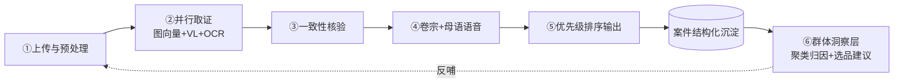
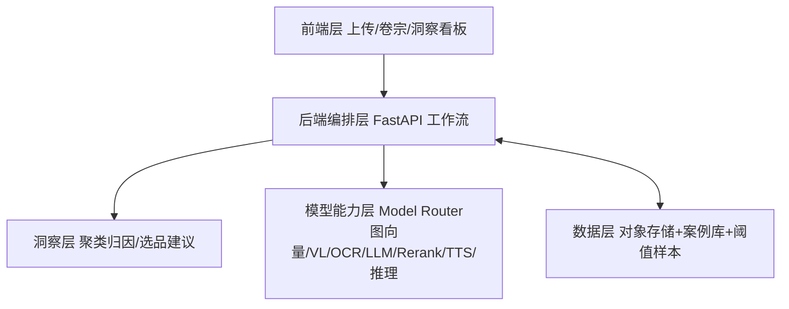

# ReturnGuard（退件法医）· 跨境退货情报站
### AI+跨境黑客松巅峰赛 · 创意初赛提交方案
### 参赛赛道：**AI 市场洞察 · AI 智能选品引擎**
> 子方向定位：**退货纠纷数据驱动的选品避坑与品控洞察**。本方案以"多模态取证"为数据采集管道，沉淀海量真实退货负面信号，最终反哺选品与品控决策——直接对应官方对 AI 市场洞察的定义："将海量数据转化为可执行的选品与竞争策略"。

---

## 1. 方案名称

**ReturnGuard（退件法医）** —— 跨境退货情报站

> 英文名 ReturnGuard 直指"守护退货权益"；中文"退件法医"点明核心能力：**用多模态 AI 对退货纠纷做客观取证，并把沉淀的退货数据转化为选品与品控的市场洞察**。本方案参赛赛道为 **AI 市场洞察**：不仅帮卖家在单笔纠纷里"少赔"，更帮卖家看清"钱到底漏在哪些 SKU / 品类 / 供应商"，反哺选品决策。

---

## 2. 方案概述

### 2.1 解决的问题
跨境卖家在退货纠纷（AliExpress 纠纷、Amazon A-to-z、PayPal 争议）中，平台通常倾向判买家赢。败诉的主因不是"理亏"，而是**拿不出客观证据**证明：退回的是不是本店那一件、有没有被调包、实际状态是否符合 listing 承诺。
更深一层：卖家**只有单案救火，缺乏群体层洞察**——不知道哪些 SKU / 品类 / 供应商是退货重灾区、缺陷根因是什么，因而无法在选品与品控环节前置规避。

### 2.2 目标用户与业务痛点
- **目标用户**：做跨境的中小卖家（3C / 饰品 / 小家电 / 服饰为高发）、品牌出海团队、代运营 / 货代。
- **业务痛点**
  1. 跨境退货率普遍 **20%–30%**，纠纷败诉 = 净亏货款 + 运费 + 店铺权重。
  2. 卖家靠肉眼比图，无法量化"是否同一件 / 是否被调包 / 是否货不对板"。
  3. 举证材料零散（聊天记录、随手拍照片），平台仲裁方无耐心细看，常直接判买家。
  4. 多语种平台下，卖家不会用当地语言写出有说服力的举证陈述。
  5. **缺乏群体洞察**：单案救火救得了一时，却看不清退货的结构性来源，无法反哺选品与品控。

### 2.3 核心功能（6 项：前 5 项为多模态取证管道、沉淀案件数据，第 6 项「退货群体洞察」为 AI 市场洞察主交付物）
1. **同款一致性比对**：退回实物图 vs 本店主图 / 详情图，输出图像向量余弦相似度，判断是否同一 SKU、是否被调包。
2. **瑕疵 / 状态视觉识别**：`qwen3-vl-plus` 自动标注破损位置、缺件、污渍、使用痕迹（客观描述，不下责任结论）。
3. **与 listing 承诺一致性核验**：比对退回件实际状态 vs 本店 listing 当初承诺的状态（货不对板检测）。
4. **一键证据卷宗 + 母语语音陈述**：自动生成结构化《举证报告》+ 关键帧红框标注 + `qwen3-tts` 生成 60 秒母语语音，直提交平台仲裁方。
5. **案件优先级队列**：`qwen3-rerank` 把高金额 / 高胜算案件排前，先救大单。
6. **退货群体洞察（洞察层 · 赛道核心）**：聚合历史案件，用推理模型聚类缺陷类型、定位高纠纷 SKU / 供应商，输出《选品 / 品控洞察报告》与整改建议（换供应商、加固包装、改写 listing 承诺等）。

### 2.4 方案亮点
- **客观度量，而非主观争论**：用多模态向量把"像不像同一件"变成可量化的相似度分数。
- **AI 只取证、不裁决**：所有输出是"证据 + 分数"，最终由平台 / 人裁决，规避法律风险、更可信。
- **多语母语举证**：适配全球平台的语种环境，举证陈述本地化。
- **双闭环价值（本案差异化）**：个案举证挽回赔款 + 群体洞察反哺选品 / 品控，**把售后成本中心变成市场洞察数据源**——这正是 AI 市场洞察赛道的落点。
- **一套 API 串联 7 项能力**：文 / 图 / 向量 / 排序 / 语音 / 推理全部走统一 Model Router。

### 2.5 预期效果
- 单案举证耗时：从 **2–3 小时 → 3–5 分钟**。
- 纠纷胜诉率：目标提升 **20–30 个百分点**（从当前约 30% 向 60%+ 努力），直接挽回赔款。
- **未来退货率下降**：洞察层输出的选品 / 品控建议，从源头降低退货结构占比，形成持续增益。
- 选品决策：从"凭感觉"到"凭退货数据"，可量化、可复盘。

---

## 3. 技术方案

### 3.1 拟使用的模型 / 能力（映射 Model Router API）
| 能力 | 模型标识 | 用途 |
|---|---|---|
| 多模态图像向量 | `qwen/tongyi-embedding-vision-plus` | 同款一致性余弦相似度 |
| 视觉理解 | `qwen/qwen3-vl-plus` | 瑕疵 / 状态识别、与描述一致性 |
| OCR | `qwen/qwen-vl-ocr` | 提取本店 listing 图文承诺 |
| 文本生成（多语） | `qwen/qwen3-max` / `qwen/qwen-long` | 证据卷宗、母语举证陈述 |
| 排序 | `qwen/qwen3-rerank` | 案件优先级重排 |
| 语音合成 | `qwen/qwen3-tts-instruct-flash` | 母语语音陈述（Chelsie / Ethan / Serena） |
| 推理 / 聚类 | `qwen/deepseek-r1`（或 `qwen/qwq-plus` 流式） | 洞察层：缺陷聚类、根因归因、选品建议 |

> 所有接口均走 **阿里云百炼平台 · Model Router**（`https://model-router.edu-aliyun.com/v1`，OpenAI 兼容，Bearer 鉴权）。核心 AI 能力全部经 Model Router 调用，符合赛事"必须使用阿里云百炼平台"的硬性要求。
> 模型可用性说明：方案按 Model Router 文档全量设计；若个别模型未纳入赛事发放额度，可降级替代——多模态向量比对可退化为 `qwen3-vl-plus` 文本化描述比对，聚类推理可退化为 `qwen3-max` + 规则聚合，主链路不受影响。

### 3.2 AI Agent / 工作流（双阶段）
**阶段 A · 个案举证（实时 / 准实时）**
```
① 上传与预处理（退回图 + 本店主图/详情图/包装图 + 原始 listing 文本）
        │
② 并行取证（三路同时）
   ├─ 图向量比对      → tongyi-embedding-vision-plus → cosine 相似度
   ├─ 视觉瑕疵识别     → qwen3-vl-plus（标注破损/缺件/污渍）
   └─ listing 承诺提取 → qwen-vl-ocr + qwen3-max（结构化承诺要点）
        │
③ 一致性核验（qwen3-max）：退回件实际状态 vs listing 承诺 → 货不对板判定
        │
④ 证据卷宗生成（qwen3-max）+ 关键帧红框标注 + 母语语音陈述（qwen3-tts）
        │
⑤ 优先级排序（qwen3-rerank）→ 输出可下载 / 可提交的证据包
        │
        └─► 案件结构化沉淀（SKU / 缺陷标签 / 金额 / 结果）存入案例库
```
**阶段 B · 群体洞察（异步批处理，洞察层）**
```
⑥ 洞察聚合（deepseek-r1 / qwen3-max）
   ├─ 按 SKU / 品类 / 供应商聚合纠纷率与退款金额
   ├─ 聚类缺陷类型（包装破损 / 货不对板 / 功能故障 …）
   ├─ 根因归因（包装? 供应商质量? listing 过度承诺?）
   └─ 输出《选品 / 品控洞察报告》+ 可执行建议 → 反哺选品 / 品控 / listing 改写
```
- 举证 Agent 负责多步推理与材料组织；图像嵌入、VL、OCR、TTS 均为同步调用，个案可在分钟级返回，适合实时演示。
- 洞察层为异步批处理，定时（如每日）对案例库聚合，输出洞察报告。

### 3.3 数据处理方式
- **输入**：退回实物图（1–N 张）、本店主图 / 详情图 / 包装图、原始 listing 文本。
- **图像可达性**：卖家上传图存入对象存储生成公开 URL，供嵌入 / VL / OCR 服务端拉取（符合 API 入参要求）。
- **相似度计算**：向量在本地做余弦相似度，无需独立向量库；阈值用卖家历史"真同款 / 真调包"样本标定。
- **案例结构化沉淀**：每案产出 {SKU, 相似度, 缺陷标签, 金额, listing 一致性, 结果}，存入案例库，供洞察层聚合。
- **隐私与合规**：图片仅用于本次比对，可选不留存；相似度分数与标注结果可审计。

### 3.4 前后端及其他技术组件
- **前端**：Web 上传页（React / Vue）+ 结果卷宗页（相似度条、关键帧标注、报告下载、语音播放）+ **洞察看板页**（高纠纷 SKU 排行、缺陷类型分布、选品建议）。
- **后端**：Python（FastAPI）编排工作流，管理任务状态、案例库与对象存储。
- **存储**：对象存储（图片 URL）+ 轻量数据库（案件 / 阈值样本 / 洞察结果）。
- **部署**：容器化，单服务即可 demo；生产可水平扩展。
- **验证脚本**：`verify_api.py` 已就绪，用于跑通图向量比对与 TTS→ASR 闭环（见附加材料）。

---

## 4. 附加材料

### 4.1 流程图（见下方图示 / 文档末尾 mermaid）
- 阶段 A 个案举证 DAG：上传 → 三路并行取证 → 一致性核验 → 卷宗 + 语音 → 优先级排序。
- 阶段 B 群体洞察：案件沉淀 → 聚类归因 → 选品 / 品控建议 → 反哺选品 / listing。

### 4.2 架构图（见下方图示 / 文档末尾 mermaid）
- 五层：前端层 → 后端编排层 → 洞察层 → 模型能力层（Model Router）→ 数据层（对象存储 + 案例库 + 阈值样本）。

### 4.3 代码仓库
- 验证与核心调用脚本：`verify_api.py`（纯标准库，零依赖，验证图向量比对 + TTS→ASR 闭环）。
- 仓库地址（待提交后补充）：`https://github.com/<your-org>/returnguard`

### 4.4 测试截图 / 演示视频
- 待 API Key 就位后，运行 `verify_api.py` 取得图向量比对 PASS 截图与举证卷宗样例，补入本材料。
- 初赛可附 3 分钟录屏：上传一张退回图 → 系统输出相似度 + 瑕疵标注 + 举证报告 + 语音；并展示洞察看板（高纠纷 SKU 排行）。

### 4.5 复赛交付物规划（开发阶段路线图）
依据赛程（复赛 9.1–9.13、决赛 9.25 路演），本方案进入开发阶段后将交付：
- **可运行 Demo**：Web 应用，上传退回图 + 本店主图 → 输出相似度分数、瑕疵标注、举证报告、母语语音，并展示洞察看板（高纠纷 SKU 排行、缺陷分布、选品建议）。
- **代码仓库**：GitCode 公开仓库，含 FastAPI 编排、前端、对象存储适配、`verify_api.py` 验证脚本。
- **演示视频**：3 分钟录屏，覆盖"单案举证 + 群体洞察"双闭环，并附体验地址 / 测试账号。
- **技术说明**：模型调用清单（Model Router 模型 ID + 调用方式）+ 架构图 + 数据处理与隐私说明。
- **体验地址**：容器化部署的临时公网 Demo（决赛可现场演示）。

---

## 附录：mermaid 流程图（便于复制到支持 mermaid 的平台）



## 附录：mermaid 架构图


